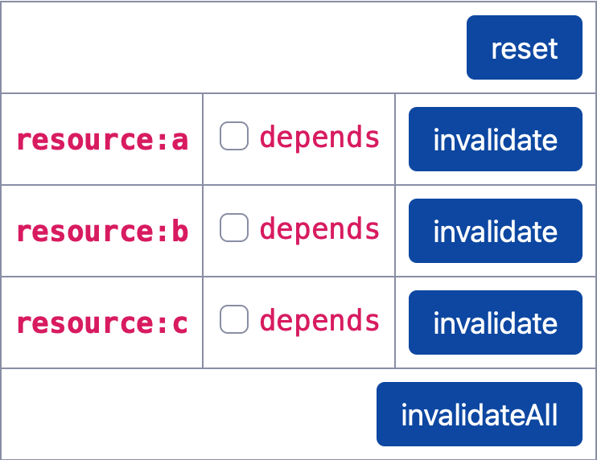

# SvelteKit Invalidations

This project demonstrates unexpected behavior with SvelteKit invalidations.

## Summary

After a dependency has been marked invalid, further invalidations of any resource will rerun a
`load` function if it is dependent on the first resource, even after `load` has run following the
first invalidation. Invalidated resources remain invalid until the next navigation.

If `invalidateAll` has marked all dependencies invalid, further invalidations of any resource will
rerun any `load` function. This condition remains until the next navigation.

## Impact

An application that:

  - depends on several resources, individually, over several pages, and
  - receives a stream of resource ids from a server that it invalidates, and
  - invalidates the resource for the current page

will needlessly cause the page to refresh as it invalidates each following resource.

## Reproduction

The following steps demonstrate the issue. Key events are logged to the console as:

  - `beforeNavigate` and `afterNavigate` lifecycle events

    - navigation before
    - navigation after

  - `load` invocations, and `load` calls to `depends`

    - load
    - load `depends('*resource*')`

  - Event handler calls to `invalidate` or `invalidateAll`

    - event `invalidate('*resource*')`
    - event `invalidateAll`

### Click _reset_

Observe that the table background flashes to indicate when the view renders.

  

    Console
  

  - navigation before
  - load
  - navigation after

### ✔ `invalidate` without `depends`

#### Click _invalidate_ for `resource:a`

  

    Console
  

  - event `invalidate('resource:a')`

✔ The view does not render, as expected.

#### Click _reset_

  

    Console
  

  - navigation before
  - load
  - navigation after

### ✔ `invalidate` with `depends`

#### Click to select _`depends`_ for `resource:a`

  

    Console
  

  - navigation before
  - load
  - load `depends('resource:a')`
  - navigation after

#### Click _invalidate_ for `resource:a`

  

    Console
  

  - event `invalidate('resource:a')`
  - load
  - load `depends('resource:a')`

✔ The view renders, as expected.

#### Click _reset_

  

    Console
  

  - navigation before
  - load
  - navigation after

### ✖ `invalidate` on a non-`depends` resource following `invalidate` with `depends`

#### Click to select _`depends`_ for `resource:a`

  

    Console
  

  - navigation before
  - load
  - load `depends('resource:a')`
  - navigation after

#### Click _invalidate_ for `resource:b`

  

    Console
  

  - event `invalidate('resource:b')`

✔ The view does not render, as expected.

#### Click _invalidate_ for `resource:a`

  

    Console
  

  - event `invalidate('resource:a')`
  - load
  - load `depends('resource:a')`

✔ The view renders, as expected.

#### Click _invalidate_ for `resource:b`

  

    Console
  

  - event `invalidate('resource:b')`
  - load
  - load `depends('resource:a')`

✖ The view renders, unexpectedly.

#### Click _reset_

  

    Console
  

  - navigation before
  - load
  - navigation after

### ✖ `invalidate` following `invalidateAll`

#### Click _invalidate_ for `resource:a`

  

    Console
  

  - event `invalidate('resource:a')`

✔ The view does not render, as expected.

#### Click _invalidateAll_

  

    Console
  

  - event `invalidateAll()`
  - load

✔ The view renders, as expected.

#### Click _invalidate_ for `resource:a`

  

    Console
  

  - event `invalidate('resource:a')`
  - load

✖ The view renders, unexpectedly.
